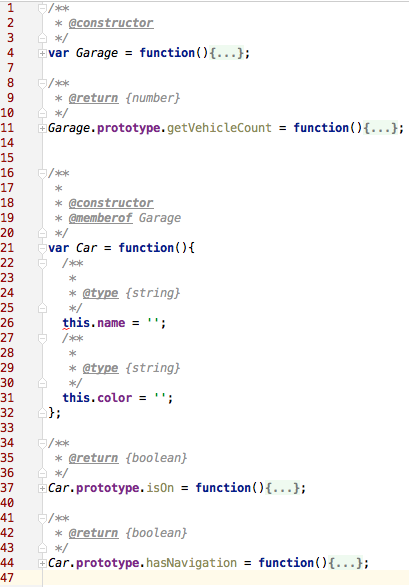
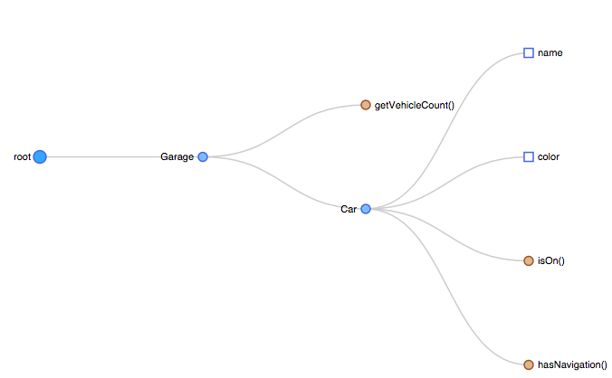

## jsdoc2diagram

jsdoc2diagram is a [JSDoc](http://usejsdoc.org/) template that creates a [D3 tree diagram](http://bl.ocks.org/d3noob/8329404) from your code's jsdoc documentation.

#### Code

#### Diagram

### Getting Started

- npm install jsdoc
- npm install jsdoc2diagram
- jsdoc -t `PATH/TO/jsdoc2diagram` -r `JS_SOURCE_DIR/FILE` -d `OUTPUT_DIR`

### Reference

- http://usejsdoc.org/
- http://bl.ocks.org/d3noob/8329404

### License

Licensed under The MIT License (MIT)

For the full copyright and license information, please view the LICENSE.txt file.

